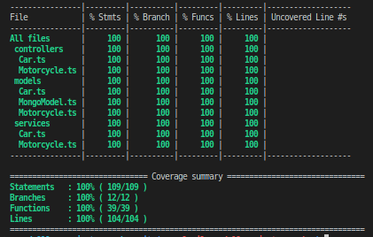
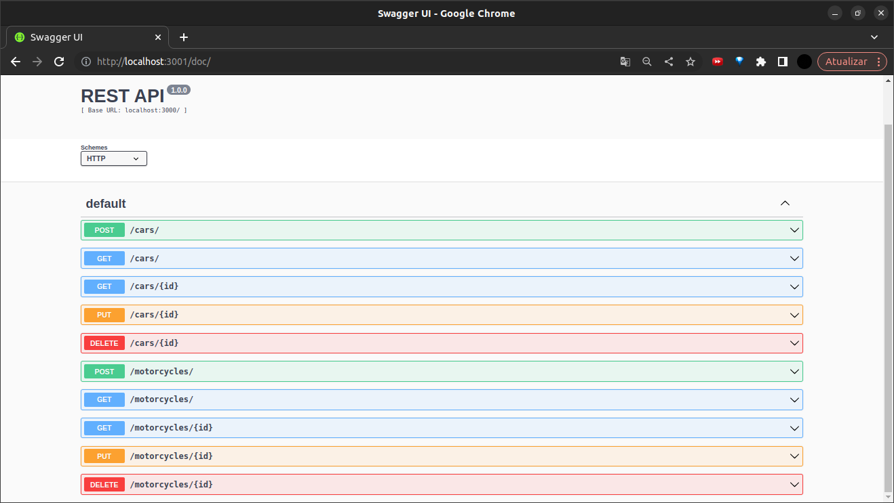

# About

This challenge deals with the development of a Back-end application in Node.js using Express, applying the principles of Object Oriented Programming (`OOP`) to build an API with `CRUD` to manage a car dealership. This will be done using the `MongoDB` database.

following `MSC` software architecture (Model - Service - Controller) and `REST` web architecture principles, connecting to a `MySQL` database for information persistence.

# ****Technologies Used****

&nbsp;
&nbsp;
&nbsp;
&nbsp;
&nbsp;
&nbsp;
&nbsp;
&nbsp;
&nbsp;
&nbsp&nbsp;
&nbsp;
&nbsp;
&nbsp;
&nbsp;

# Decisions

* For the development of the application, I chose to use `Node.js` technologies, as it is an engine (engine) already based on `JavaScript`, widely supported and with non-blocking IO (using async methods for stacks), with `Express`, which is a mature framework and tested, which provides a number of useful abstractions for building HTTP APIs in ` Node.js.` This is because they are tools where I have solidified knowledge and domain, thus enabling an agile and safe development of the entire project;
* The software architecture chosen was the `MSC` (Model - Service - Controller) as already mentioned in the introduction, as it is a layered architecture model, which improves the organization and division of responsibilities in `Node.js` applications with `Express`;
* The database chosen for the persistence of information was `mongodb`, which is a document-oriented database and was designed to store a large scale of data, in addition to allowing you to work efficiently with large volumes. Its advantage is the permission to create multiple databases and multiple collections within the main one.
* For the tests, considering the application in `Node.js` with `Express`, I opted for the triad `Chai` (for assertions, providing ways to tell the code what I expect, test and validate the return), `Mocha` (as framework/base “describe / it ” tests for JS) and `Sinon` (which provides the functions for test doubles or test doubles, simulations of code interactions with dependencies external to it), since they are established tools and also where I present full knowledge and domain.
* As a tool to ensure code compliance, standardization and quality, I used `ESLint`.

# Tests

* The application had 100/100% of all its main functionalities tested, in all layers and always considering the success and error cases.

  

# Usage

If you don't have MongoDB installed on your machine and want to use Docker, just follow the steps below:

1. Download the MongoDB image:

```sh
  docker pull mongo
```

2. Create the MongoDB container:

```sh
  docker run --name <container-name> -p 27017:27017 -d mongo
```

3. Check if the container is running:

```sh
  docker ps
```

## Docker

> Run the `node` and `mongodb` services with the command `docker-compose up -d`.

- Remember to stop `mongo` if you are using it locally on the default port (`27017`), or adapt if you want to make use of the application in containers
- These services will initialize a container called `car_shop` and another one called `car_shop_db`.
- From here you can run the `car_shop` container via CLI or open it in VS Code.

> Use the command `docker exec -it car_shop bash`.

- It will give you access to the interactive terminal of the container created by compose, which is running in the background.

> Install dependencies [**If any**] with `npm install`

  ⚠ Attention ⚠ If you choose to use Docker, **ALL** the commands available in `package.json` (npm start, npm test, npm run dev, ...) must be executed **INSIDE** the container, that is, in the terminal that appears after executing the `docker exec` command mentioned above.

  ⚠ Attention ⚠ The **git** inside the container is not configured with your credentials. Either do the commits outside the container, or configure your git credentials inside the container.

  ⚠ Attention ⚠ Do not run the npm audit fix command! It updates several project dependencies, and this update conflicts with the evaluator.

  ✨ **Tip:** The `Remote - Containers` extension (which will be in the recommended extensions section of VS Code) is indicated so that you can develop your application in the Docker container directly in VS Code, as you do with your local files .

> Install dependencies [**If any**] with `npm install`

  ✨ **Tip:** To run the project this way, you must have `node` installed on your computer.
  ✨ **Tip:** The evaluator expects the `node` version used to be 16.

# Documentation

go to `http://localhost/3000/docs`


